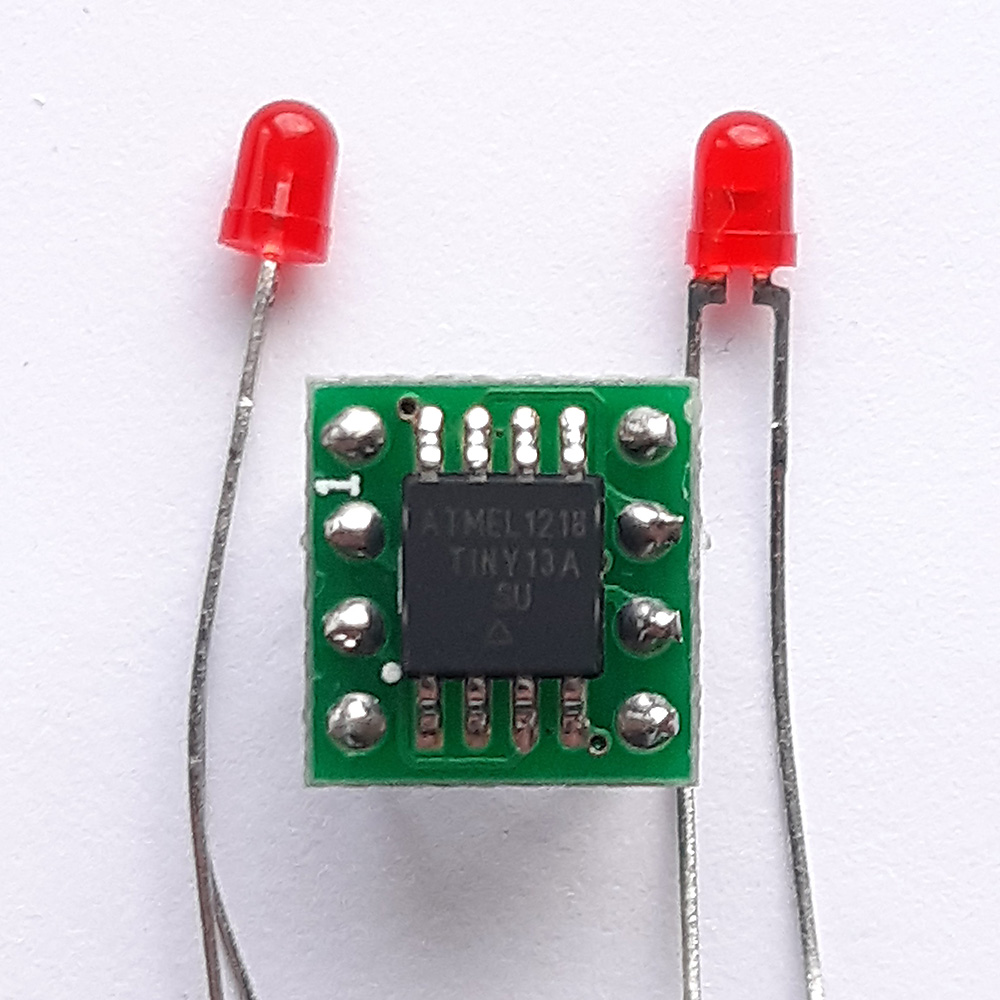

# AVR Playground

- Atmel(Microchip) AVR Educational projects
- Author: Aleksey M.

- MCU: ATtiny13A
- Datasheet: https://www.microchip.com/en-us/product/ATtiny13
- Flash 1KB, 64B SRAM, 64B EEPROM
- Speed 1.2 MHz (up to 20MHz)
- Power: 2.7-5.5V

# 

Would you like to learn microcontrollers? Do you think it is easy? :exploding_head:

Even tiny 1KB memory microcontrollers (like ATtiny13) require a deep knowledge of various fields of science such as electronics, programming, digital logic, math. Microcontrollers are not huge banking systems, and probably, programming of them will not guarantee you to earn tons of money, but it is definitely fun units for life. Just imagine what technological power people need to produce these logical units and you as a developer can get them just less, more than $1!

Step-by-step projects can help.

This storage consists easily understandable projects with notes. These projects cover all necessary topics of microcontrollers: GPIO, Interrupts, Timers, ADC, CPU, and many more. It can be used as quick solutions.

:v:

## AVR Environment Setup
- Win: Install WinAVR
- Mac: https://eekit.blogspot.com/2019/08/how-to-setup-environment-for-avr.html

## Compilation & MCU Burning
- Compilation: GCC, Make
- Burning: AVRdude Utility, USBasp or any ISP programmer

# Projects:

