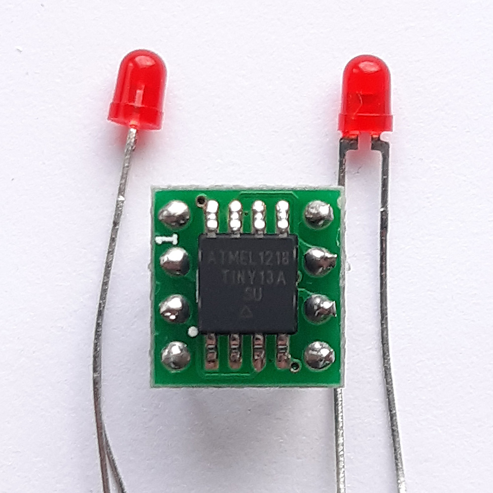

# Microcontroller?.. It's very simple! AVR [ATtiny13] Playground

- Atmel/Microchip AVR Educational projects
- Author: Aleksey M.

- MCU: ATtiny13A
- Datasheet: https://www.microchip.com/en-us/product/ATtiny13
- Flash 1KB, 64B SRAM, 64B EEPROM
- Speed 1.2 MHz (up to 20MHz)
- Power: 2.7-5.5V, 190 μA at 1.8V, 1 MHz
- One 8-bit Timer/Counter
- 2 PWM Channels
- One 10-bit ADC, 4 Channels

## 1. Intro

Would you like to learn microcontrollers? 
Do you think it is easy?

Salad from registers, bits, operations, and modes... :exploding_head:

Even tiny 1KB memory microcontrollers (like ATtiny13) require a deep knowledge of various fields of science such as electronics, programming, digital logic, math. Microcontrollers are not huge banking systems, and probably, programming of them will not guarantee you to earn tons of money, but it is definitely fun units for life. Just imagine what technological power people need to produce these logical units, and you as a developer can get them just less or more than $1!

This storage consists easily understandable files with pure notes. These step-by-step projects cover all necessary topics of microcontrollers: GPIO, Interrupts, Timers, PWM, ADC, CPU, and many more. 

Quick projects for the weekends hack!

:v:

## 2. AVR Environment Setup. Compilation & MCU Burning
- Win: Install WinAVR
- Mac: https://eekit.blogspot.com/2019/08/how-to-setup-environment-for-avr.html
- Compilation: GCC, Make
- Burning: AVRdude Utility, USBasp or any ISP programmer

## 3. Pinout

## 4. Licensing
- You can learn and run code without any limitations or restrictions
- You are not permitted to use any projects "as is" for commercial purposes, courses, articles, and similar contexts

## 4. Projects
- 01_Blinking_LED
- 02_Button
- 02_Button_Multiply_Modes
- 03_0_Interrupts_External_INT0
- 03_1_Interrupts_External_PCINT

